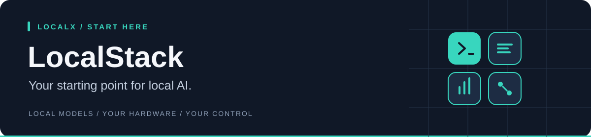

<div align="center">
  <h1>LocalStack</h1>
  <p><strong>The front door to the LocalX ecosystem.</strong></p>
  <p>
    <a href="https://c0degeek-dev.github.io/LocalStack/">Open the site</a> ·
    <a href="https://c0degeek-dev.github.io/LocalStack/#projects">Explore the projects</a> ·
    <a href="https://github.com/C0deGeek-dev/LocalStack/issues">Report an issue</a>
  </p>
  <p>
    
    
  </p>
</div>

LocalStack explains how the four LocalX tools fit together, shows the evidence
behind the agent harness, and gives new users one clear place to begin. Current
release train: `v5.0.0`.

## Choose your starting point

| I want to… | Go here |
|---|---|
| Install LocalX and keep it updated | [Install the tools](#install-localx) |
| Run a model on my computer | [LocalBox](https://github.com/C0deGeek-dev/LocalBox#run-your-first-model) |
| Code with a local or hosted model | [LocalPilot](https://github.com/C0deGeek-dev/LocalPilot#your-first-coding-session) |
| Review and reuse project lessons | [LocalMind](https://github.com/C0deGeek-dev/LocalMind#start-with-the-browser-interface) |
| Find better model settings | [LocalBench](https://github.com/C0deGeek-dev/LocalBench#tune-a-model-you-already-use) |

**This repository contains the LocalX website.** You do not need to clone it to
use the tools. [Open the site](https://c0degeek-dev.github.io/LocalStack/) for an
overview, or install directly below.

## Install LocalX

**No programming tools or compilation required.** The installer downloads ready-to-run
applications and checks their SHA-256 checksums. You get **LocalBox, LocalPilot,
LocalMind, and LocalBench**, plus `localx` for managing them and the llama.cpp
engine for running models. You do not need to clone this repository.

### 1. Run the installer

**Windows 10/11 (64-bit Intel or AMD):** open the Start menu, type **PowerShell**,
and open it. Paste this command, then press **Enter**:

```powershell
irm https://raw.githubusercontent.com/C0deGeek-dev/LocalPilot/main/install/install.ps1 | iex
```

**Linux (x86-64 or ARM64) / macOS (Apple Silicon):** open **Terminal**, paste
this command, then press **Enter**:

```sh
curl -fsSL https://raw.githubusercontent.com/C0deGeek-dev/LocalPilot/main/install/install.sh | sh
```

### 2. Let your terminal find the commands

`PATH` is the list of folders your terminal searches for applications. Add the
LocalX folder once so commands such as `localx update` work from any directory.

<details>
<summary><strong>Windows — paste this into the same PowerShell window</strong></summary>

```powershell
$localxBin = Join-Path $env:LOCALAPPDATA 'localx\bin'
$userPath = [Environment]::GetEnvironmentVariable('Path', 'User')
if (($userPath -split ';') -notcontains $localxBin) {
    [Environment]::SetEnvironmentVariable('Path', "$localxBin;$userPath", 'User')
}
$env:Path = "$localxBin;$env:Path"
```

This enables the commands in this window and saves the setting for future
terminals. If another open terminal cannot find them, close and reopen it.

</details>

<details>
<summary><strong>Linux / macOS — add LocalX to your shell's PATH</strong></summary>

Paste this into your terminal:

```sh
export PATH="${XDG_DATA_HOME:-$HOME/.local/share}/localx/bin:$PATH"
```

To keep it for future terminals, add the same line to your shell configuration:
`~/.bashrc` for Bash or `~/.zshrc` for Zsh. Use the directory printed by the
installer if it differs.

</details>

### 3. Check the installation

```sh
localx status
```

You should see the installed tools and engine. **Installing the tools does not
download an AI model**; choose one when you start using LocalBox.

Want to read the installer before running it, check platform support, or install
a specific version? See the [installation guide](https://github.com/C0deGeek-dev/LocalPilot/blob/main/docs/install.md).

## Updates and troubleshooting

| I want to… | Run |
|---|---|
| Update the whole stack and model engine | `localx update` |
| See installed versions | `localx status` |
| Diagnose installation problems | `localx doctor` |
| Retry an incomplete installation | `localx install` |

Ordinary installs use published releases; updates do not require Rust or Git.
If a command is “not recognized” or “not found”, complete the PATH step above.
If an older installation is taking precedence, `localx doctor` identifies it;
review its findings before using `localx doctor --fix` to remove old copies.

## Privacy by design

LocalX is local-first by default. The tools do not send usage telemetry, prompts,
code, model activity, memories, or benchmark results to us. Models, transcripts,
reports, configuration, and learned project knowledge stay on hardware and in
paths you control. Cross-device memory sync, when you choose to enable it, is
end-to-end encrypted.

There is no forced LocalX account or cloud service. Remote actions—such as a
model download or a hosted provider you configure—are explicit choices. When
you stay on the local path, your working data stays local. The LocalStack site
itself is static and includes no analytics, cookies, forms, or client-side
tracking.

## The toolchain

| Project | What it does | Start here |
|---|---|---|
| [LocalBox](https://github.com/C0deGeek-dev/LocalBox) | Runs local GGUF models and connects them to coding agents | Install a local runtime |
| [LocalBench](https://github.com/C0deGeek-dev/LocalBench) | Finds fast, stable settings for your hardware | Tune a model |
| [LocalPilot](https://github.com/C0deGeek-dev/LocalPilot) | Drives models through a tool-using coding-agent harness with deep, auditable research and MCP coaching | Start coding |
| [LocalMind](https://github.com/C0deGeek-dev/LocalMind) | Turns reviewed sessions and docs into local memory you can browse, query over MCP, and sync | Add local learning |

```text
LocalBox ──> LocalBench
    │            │
    └──────┬─────┘
           ▼
      LocalPilot <──> LocalMind
```

<details>
<summary><strong>Contribute to the website: preview, layout, and deployment</strong></summary>

## Preview locally

The site is deliberately simple: static HTML, CSS, and SVG assets with no build
step.

```sh
git clone https://github.com/C0deGeek-dev/LocalStack.git
cd LocalStack
python -m http.server 8000
```

Open `http://localhost:8000` in your browser.

You can also open `index.html` directly, but a local server matches GitHub Pages
URL behavior more closely.

## Repository layout

```text
LocalStack/
├── index.html                         page content and structure
├── styles.css                         responsive theme and ecosystem animation
├── site.js                            tool explorer and install controls
├── assets/
│   ├── localstack-mark.svg            favicon and brand mark
│   ├── localpilot-vs-raw.svg          raw-vs-harness benchmark chart
│   ├── localpilot-four-arm.svg        four-arm methodology chart
│   └── og.png                         social preview
└── VERSION                            release-train version
```

## Editing the site

- Keep the page dependency-free and usable with JavaScript disabled.
- Keep project details in their owning repositories; this site is an overview,
  not a second documentation tree.
- Preserve useful alt text and semantic headings when changing visuals.
- Check wide and narrow layouts before publishing.
- Treat benchmark deltas as the claim; absolute scores need their caveats.

## Deployment

GitHub Pages publishes the static repository. A content-only change needs no
generated build artifact—update the source files, preview them locally, and let
Pages serve the committed result.

</details>

## License


LocalX-owned source is available under the
[PolyForm Noncommercial License 1.0.0](LICENSE). Commercial use requires a
separate license. See [LICENSING.md](LICENSING.md) for the commercial contact,
the 30 August 2026 licensing boundary, and third-party terms.
